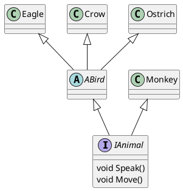

## [WORKSHOP] - Introduction to OOP using C#
Hi everyone, in this workshop, you will be introduced to the basic concepts of the OOP (Object Oriented Programming).
The OOP is a paradigm that allows you to create objects that contains methods and properties.
You can make public stuff (usable inside and outside the class), private (that is only usable within the class) and
protected (like private but usable from child classes).

You can also make class inherit from others:
Let's say i have a class named Animal that can Speak and Eat
I can make a Dog class that inherits from Animal so it can Speak and Eat.
In inheritance it is also possible to override inherited methods to change it's behavior
(let's say that when an Animal Speak, it meows, i can override this in Dog and make it bark).

### Setup
For this workshop you will have to setup your development environment.

- If you are on Windows you will have to use visual studio (https://docs.microsoft.com/en-us/visualstudio/install/install-visual-studio?view=vs-2019).
- If you are on unix system you will have to use mono and mono-msbuild. (https://www.mono-project.com/docs/getting-started/install/linux/)
---
### Work:
Now that your development environment is ready you can start exercises !

#### The first step
For this first step you will have to create a program that will display "Hello, World" on the standard output followed by a carriage return.

---

#### Your first class
For this step, you will have to create a simple class named Vector. This class will have two private properties:
 - X (an int)
 - Y (an other int)

This class will also have a constructor that takes X and Y parameters to set properties.

---

#### Getters, setters
Now that you created your Vector class with it's two properties, you may want to set or get it's location by reading / editing X and Y.
Fortunately, OOP provides us things named `getter` and `setter`. It allows you to access private member variables. 
For this job, you will create a getter and a setter for both X and Y properties.

---

#### Overloading operators
For some reason, you may want to add or sub two vectors. Again, OOP is well-thought and provides us operator overloads.
Operator overloads are things that allows you to change the behavior of operators by re-implementing it.
For this step, you will overload the + and the - operator to make it add and sub vectors.

---

#### Overriding methods
You can now create a Vector with a given X and Y, change it's position and add / sub it with an other vector.
You may want to convert it to a string to easily print it on the stdout.
For this, you will have to override the ToString() method.
Override it and make it return `"Vector(x = [VECTOR X PROPERTY] y = [VECTOR Y PROPERTY])"`

---

#### Inheritance
Let's create an Animal class. This class will:
 - Contain a position (stored as a Point structure that must be convertible to string)
 - contain a velocity vector (You must overload + operator between points and vectors)
 - Have a `void Move()` method that prints "Hello, human" when called
 - Have a `void Walk()` method that updates position with velocity when called
 - Have a `Vector GetPosition()` method that returns the position when called.
 - Be convertible to string by overriding the ToString method. It must return `Animal(Velocity = [VELOCITY TO STRING], Position = [POSITION TO STRING]`)

Now that you have your animal class create three classes:
 - Monkey
 - Dog
 - Cat
 - Elephant

The monkey class must print "Hello, human, im a monkey !" when Speak is called. It must have a velocity of 10 and when ToString is called,
it must return the same thing as Animal but with `Monkey(` instead of `Animal(`

The dog class must print "Hello, human, im a dog !" when Speak is called. It must have a velocity of 8 and when ToString is called,
it must return the same thing as Animal but with `Dog(` instead of `Animal(`

The cat class must print "Hello, human, im a cat !" when Speak is called. It must have a velocity of 5 and when ToString is called,
it must return the same thing as Animal but with `Cat(` instead of `Animal(`

The elephant class must print "Hello, human, im an elephant !" when Speak is called. It must have a velocity of 1 and when ToString is called,
it must return the same thing as Animal but with `Elephant(` instead of `Animal(`

---

#### Abstracts
Now that you just created an animal class with several animals you may notice that having a Speak method in the parent Animal class
is useless. Once again, OOP paradigm has take care of you ! There is something called abstract that will help you !
Abstracts class are class with several methods, some implemented, some that MUST be implemented by the child class in order to instantiate it.
**Abstracts class cannot be instantiated**, it **must** be inherited.

For this step, you will transform the Animal class to an abstract class by removing the default behavior of the Speak method.

---

#### Interfaces

Sometimes, you want to define a class with a set of methods without defining any behavior. Theses classes are called Interfaces
It can be really useful to define interface as it defined a contract of the function the child MUST implement. Interfaces are also useful
as they can be upcasted to provide generic methods.

For this step, you will create an IAnimal interface with two methods: Speak and Move).
You will create an abstract named ABird that inherits from IAnimal and that overrides the Move method to write `Flying at [INSERT SPEED HERE]`.
You will create the following classes:
 - an Eagle that inherits from ABird and overrides the Speak method to write `Hi, im an eagle`
 - a Crow that inherits from ABird and overrides the Speak method to write `Hi, im a crow`
 - an Ostrich that inherits from ABird, overrides the Speak method to write `Hi, im an Ostrich` and the Move method to write `Running at speed [INSERT SPEED HERE]`
 - a Monkey that inherits from IAnimal, overrides the Speak method to write `Hi, im a Monkey` and the Move method to write `Running at speed [INSERT SPEED HERE]`

Here is your inheritance tree at puml format:

---

#### Upcasting

Now that you've created your interface, your abstract and your classes, create a new class named Controller that has takes an Animal
in it's constructor and that have two methods named makeSpeak and makeMove.

Try to give an instance of each animal in this class constructor and see what happens.
